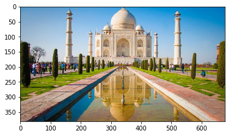
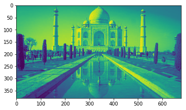
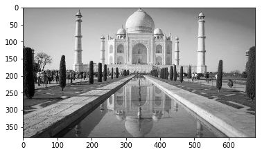

Numerical Methods. Final Project.
=================================

Pablo Muñoz Haro A01222422. Juan Antonio Olvera Robles A01630359.

Usage
-----

This ipython notebook is viewable in the browser which also provides an
interactive setting. The notebook assumes ``python3`` is available with
the libraries ``jupyter`` (for the displaying of the notebook),
``numpy`` for simplifying vetor and matrix operations and ``matplotlib``
for reading and displaying images. It is suggested that you create a
virtual environment for this project so that you do not pollute your
system-wide installation of python with these dependencies. To use the
virtual enviornment you do need to have the python ``virtualenv``
package installed system-wide, a typical usage would look like these:

::

    pip install virtualenv # ensure virtualenv is installed
    cd <dir-with-this-file>
    virtualenv venv # Create virtual envrionment "venv" (this will create a directory with a new python install)
    source ./venv/bin/activate # Activate the virtualenv
    pip install -r requirements.txt # Install all the dependencies, listed in requirements.txt file
    jupyter notebook # Open a browser tab with this notebook in interactive mode

To return to being able to use the system-wide installation of python
run the command ``deactivate`` from your terminal.

Note that you only have to setup the virtualenvironment onece, if you
wish to return to the notebook later you only have to start with the
command ``source ./venv/bin/activate # Activate the virtualenv``

.. code:: ipython3

    import numpy as np
    from matplotlib import pyplot as plt, image as mpimg

.. code:: ipython3

    # Program constants. Change these to modify the behaviour of the notebook.
    
    # The path to the input image, assumed to have RGB channels
    IMAGE_PATH = 'image01.jpg'
    
    # The path where the black and white image will be saved
    BW_IMAGE_PATH = 'image01bw.jpg'
    
    # Method to convert the 3 RGB numbers (list) into a single number, we use the mean as the default strategy
    # but you could choose something else like keeping the max of the three with np.max
    GRAYIFY_STRATEGY = np.mean

.. code:: ipython3

    img_data = mpimg.imread(IMAGE_PATH)

.. code:: ipython3

    # Display the image to ensure it was read correctly
    plt.imshow(img_data)

.. parsed-literal::

    <matplotlib.image.AxesImage at 0x10a0e3208>

.. code:: ipython3

    # A pixel of the image is a 3 number list, each number representing the intensity [0, 255] of a channel (RGB)
    img_data[0,0] # pixel 0,0

.. parsed-literal::

    array([ 62, 139, 191], dtype=uint8)

.. code:: ipython3

    def grayify(img_data):
        '''
        IMG_DATA is a numpy.array representing an image.
        
        RETURNS a numpy.array of the same x and y dimensions as IMG_DATA, where each element is the "aggregation"
        of the corresponding 3 item element of IMG_DATA, according to GRAYIFY_STRATEGY global.
        '''
        num_cols, num_rows, num_channels = img_data.shape
        
        # Create a "clone" of the image but with only one channel,
        # all pixel values initialized to 0
        gray_img = np.zeros((num_cols, num_rows))
        
        # Visit each pixel, apply the grayify strategy and set the corresponding pixel in the black and white
        # image to the result
        for col_i in range(num_cols):
            for row_i in range(num_rows):
                gray_img[col_i, row_i] = GRAYIFY_STRATEGY(img_data[col_i, row_i])
                
        return gray_img

.. code:: ipython3

    gray_img_data = grayify(img_data)

.. code:: ipython3

    # Now a pixel of the gray image is a single scalar number
    gray_img_data[0, 0]

.. parsed-literal::

    130.66666666666666

.. code:: ipython3

    # Display the gray image to ensure the grayification process succeeded
    plt.imshow(gray_img_data)

.. parsed-literal::

    <matplotlib.image.AxesImage at 0x10a55ad30>

.. code:: ipython3

    # Need to pass the cmap='gray' option to matplotlib.pyplot.imshow or else the colors are funky
    plt.imshow(gray_img_data, cmap='gray')

.. parsed-literal::

    <matplotlib.image.AxesImage at 0x10ac27630>

.. code:: ipython3

    # Save the grayified image
    plt.imsave(fname=BW_IMAGE_PATH, arr=gray_img_data, cmap='gray')
